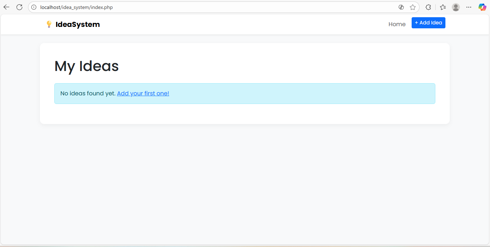
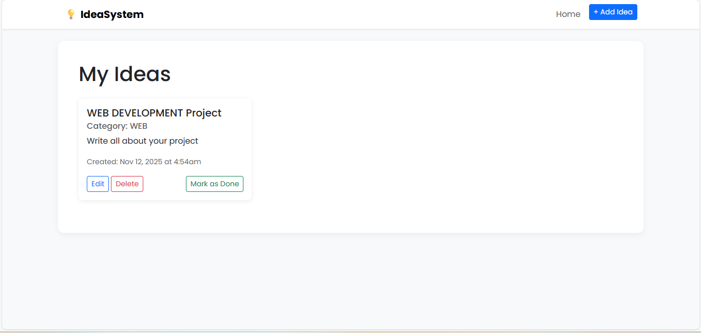
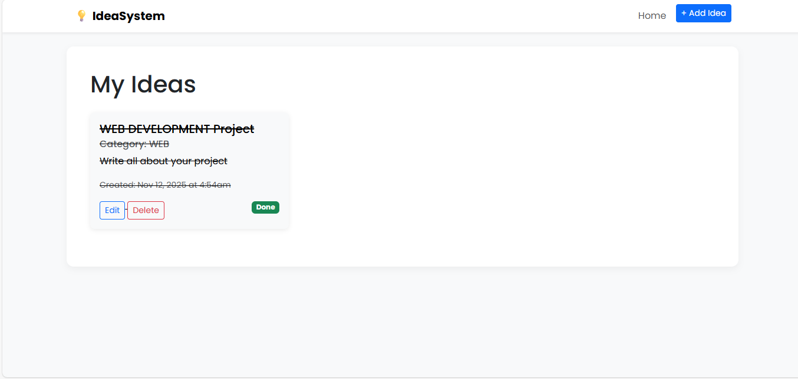
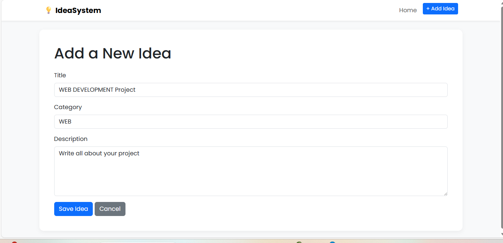

# 💡 Idea Management System (PHP)

A simple, self-hosted web application for managing personal ideas, built with **PHP**, **MySQL**, and **Bootstrap 5**. This project is a complete **CRUD** (Create, Read, Update, Delete) application, perfect for developers learning PHP or anyone needing a lightweight tool to track projects and tasks.

This application runs in a **XAMPP** environment (Apache + MySQL).

---

## 📸 Screenshots

**1. Main Dashboard (Pending Ideas)**


**2. Adding a New Idea**


**3. Idea Marked as Done**


**(Additional Dashboard View)**


---

## ✨ Features

* **Create, Read, Update, Delete (CRUD):** Full functionality to manage your ideas.
* **Mark as Done:** Easily track which ideas are completed. Completed ideas are visually "grayed out."
* **Clean UI:** A modern, responsive interface built with Bootstrap 5.
* **Simple Database:** A single, easy-to-understand table for all idea data.
* **Secure Code:** Uses **prepared statements** to prevent SQL injection attacks.

---

## 🛠️ Tech Stack

* **Backend:** PHP
* **Database:** MySQL
* **Frontend:** HTML5, CSS3, Bootstrap 5
* **Development Environment:** XAMPP

---

## 🚀 Getting Started

Follow these steps to get the project running on your local machine.

### Prerequisites

You must have **XAMPP** installed, or any other Apache/MySQL server.
* [Download XAMPP](https://www.apachefriends.org/index.html)

### 1. Installation

1.  **Clone (or download) the repo** into your `htdocs` folder.
    * The `htdocs` folder is usually at `C:\xampp\htdocs\`
    * Your project folder should be `C:\xampp\htdocs\idea_system`

2.  **Start XAMPP:** Open the XAMPP Control Panel and start both **Apache** and **MySQL**.

### 2. Database Setup

1.  Go to `http://localhost/phpmyadmin/` in your browser.
2.  Click the **SQL** tab.
3.  Copy and paste the code below and click **Go**:

```sql
-- 1. Create the database
CREATE DATABASE IF NOT EXISTS idea_system;

-- 2. Select the database to use
USE idea_system;

-- 3. Create the 'ideas' table
CREATE TABLE IF NOT EXISTS ideas (
    id INT AUTO_INCREMENT PRIMARY KEY,
    title VARCHAR(255) NOT NULL,
    description TEXT,
    category VARCHAR(100),
    status TINYINT(1) DEFAULT 0,
    created_at TIMESTAMP DEFAULT CURRENT_TIMESTAMP
);
